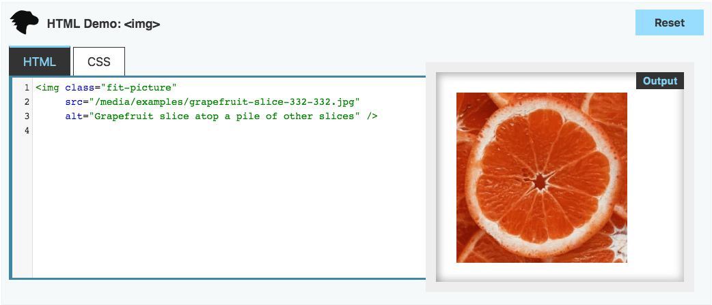
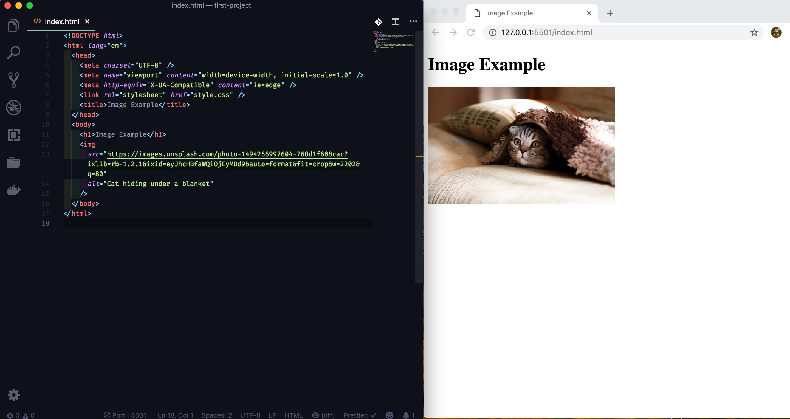

## Objectives and Overview

This lesson introduces the `` element and how to it to include images on your website. Additionally, you'll learn the importance of the _alt_ attribute, and how to link to both local images on your computer and external images from another source.

### Lesson Objectives

- Understand how to use the HTML `` element to add an image to a webpage.
- Demonstrate the ability to add images to a webpage by linking to local and external images.
- Understand and explain the role of the _alt_ attribute when adding images to a webpage.
- Be able to add an image with appropriate alt text to a webpage.

---

## Img Element

The `` element is used to add images into your HTML pages. This is used to link to both local images (images that are contained on your computer) and external images (images that are on another site).

The `` element is like anchors (`<a>`) in that it behaves differently from other tags in regard to opening/closing tags.

### Linking to Local Images

Take a look at this screenshot from MDN:


_Image Credit: MDN Web Docs_

The tag is self-closing. This means that there isn't a `</img>` closing tag.

Let's break down the example:

- The `src` attribute stands for "source" and is the actual location of the file or the URL of the image. In this example, this is linking to a local file. The value is the path of the file.
- The `alt` attribute is a description of the image.

All of this information is included within the entirely of the `img` tag. These attributes are both necessary when including images on your site.

If the `src` value is entered incorrectly or is a bad link, the image won’t properly display.

You may have noticed that your image is larger than you wanted. See if you can figure out a solution for this!

**Note:** You'll see both `` and `` used in examples. Both are correct.

### Linking to External Images

The previous example shows how to include an image that's stored locally on your computer. Let's now look at an example for linking to an external image (such as an image hosted on another site).

Instead of using the local path for your image's source, you use the image's URL. Here's an example:

```html

```

Here's a side-by-side screenshot of the full HTML code and the resulting image:


_Image Credit: Mikhail Vasilyev on Unsplash_

**Note:** If the image's source URL is invalid or improperly formatted the image won't display on the page.

#### Tip: Finding the Source for External Images

It's sometimes tricky to find the actual URL for an external image. One trick that you can use is to _right click_ on the image and click "Copy Image Address." This is the actual URL of the image. You can then use this URL as the image's source.

## Alt Attribute

The _alt attribute_ is for _alternate text_. This attribute has two purposes: it displays when an image doesn't load, and it's used by assistive screen reader technologies. Including alt text shouldn't be optional -- this is a mandatory field to include on all images in web content. If you don't include alt text on an image and someone is using a screenreader it's as if the image doesn't exist for them.

### Alt Text Example

```html

```

The alt text should be a description of the photo. You don't need to include extra text such as "An image of..." or "A photo of..." because this isn't necessary. Screenreaders often automatically insert this at the start of the description.

This can be overwhelming at times, but just try to do the best that you can. This article from The A11Y Project is a great resource: [The A11Y Project: Quick tip: Using alt text properly](https://a11yproject.com/posts/alt-text/)

### Image Attribution

Whenever you use an image that isn't yours you need to include an attribution. This is especially important if you're linking to images on external sites. At the very least you need to include the owner/photographer's name (or the website if you're unsure of the actual photographer).

There are many sites that provide royalty free images for use. Even though these images are provided for use, it's still good practice to provide attribution.

## Activity: Adding Images

Let's practice adding images with HTML. For now, let's practice using entirely local images.

### Steps:

1. Find an image on the web and download it into your project folder.
2. Save the image as something without spaces, such as "my-sample-image.jpg"
3. Link to this in an HTML file using the local image method outlined in the lesson.
4. Start the live server and check to see if the image properly displays

### Troubleshooting

One of the most common errors results from typos in the `src` attribute. Check that your image path is correct!

Refer to the examples if you need help with this. Remember to add the _alt_ text to every image you're using!

You may notice that you have little control over the image size. Don't worry -- this is something that you can control with CSS. For now, just focus on getting the images to show up on your page.
