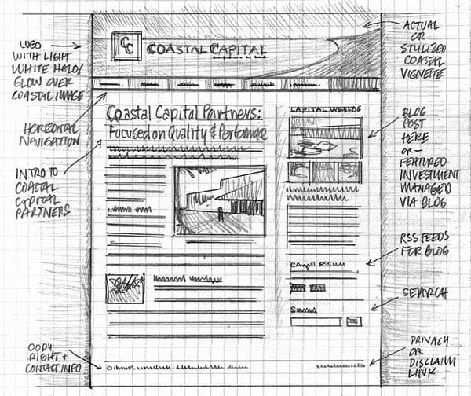

## Objectives and Overview

This lesson introduces wireframing, an important tool in the web design. The content includes some examples of wireframes as well as an activity to get started practicing the proces.

### Lesson Objectives

- Understand the benefits of creating a wireframe for a web project and demonstrate this by creating a low-fidelity wireframe.
- Practice your wireframing skills by sketching the layouts of existing websites.

### CSTA Standards
- **2-AP-10** - Use flowcharts and/or pseudocode to address complex problems as algorithms.
- **2-AP-13** - Decompose problems and subproblems into parts to facilitate the design, implementation, and review of programs.
- **2-AP-15** - Seek and incorporate feedback from team members and users to refine a solution that meets user needs.
- **2-AP-17** - Systematically test and refine programs using a range of test cases.
- **2-AP-19** - Document programs in order to make them easier to follow, test, and debug.
- **2-DA-08** - Collect data using computational tools and transform the data to make it more useful and reliable.
- **2-DA-09** - Refine computational models based on the data they have generated.

---
## Creating a Wireframe

Throughout this course you’re going to be practicing and integrating various design tools with the intention of building them into your workflow. The first skill that you’re going to use is **wireframing**. You’ll be creating low fidelity wireframes that will help you map out your site content and layout.

**Wireframes** are crude sketches using boxes and content placeholders that are used as a blueprint or map for your site. The reason that you’ll want to keep it low fidelity is so that you build the habit of designing pages that are driven by content decisions without becoming too distracted by the decorated and styled appearance of your site. At this point, focus on the layout and structure of the content and build the skeleton of your site.

## Things to Include in a Wireframe

Since the primary purpose of the wireframe is to create a blueprint/prototype, you’ll want to include elements that convey information. Before beginning, determine the content that your site needs. When working with a client, this would be done in a meeting where their layout needs are discussed. At this point, you should act as if you’re client. Think about a basic page layout that you’re going to build over the next few lessons.

One way to build this skill and develop an eye for layout is to navigate to some webpages that you like and examine the content layout. You can then create a wireframe for those pages. This will help build your skills and you’ll start to view webpages from a different perspective.

## Wireframe Examples
There are plenty of online resources that contain wireframe examples. Check out this article from *Speckyboy.com* that has 20 examples of wireframe sketches for websites: [20 Effective Examples of Web and Mobile Wireframe Sketches](https://speckyboy.com/20-effective-examples-of-web-and-mobile-wireframe-sketches/). 

Here’s one example of a sketch featured in the article:

This example contains the basic structure and layout of the page with some sample headings placed in. The layout is drawn as boxes and there are lots of notes written down around the edge of the sketch. This wireframe is a low fidelity sketch but conveys lots of information that will be a helpful roadmap for the design and development process.

Take a look at that article for some inspiration before moving on to the next activity.

## Activity: Practice Wireframe

For this activity,  select a webpage and create a crude wireframe for the site. Make sure to include all the layout elements that you think are relevant from a content perspective, and then write notes about how the site is structured.

Begin by selecting sites that contain basic visual elements. After you get some practice, start gradually copying more complex layouts.

### Steps:

- On a piece of graph paper create a wireframe for the main page.
- Include the following things:
- Basic layout (this can be done with boxes like in the examples)
- Notes and annotations about the layout and content
- Some mockups for headings and lines to represent paragraphs
- Placeholders (boxes with low-fi sketches) for images
- Create the wireframe for the main page! Remember, focus on the layout and content structure.
- Annotate (mark up) the wireframe with notes and observations.

The purpose of this activity is to actively practice reviewing and copying existing sites. It’s important to not feel intimidated during this phase -- there’s no need to create a perfect drawing. Remember, the purpose is to create a crude sketch or prototype that maps out the main layout elements of the site.