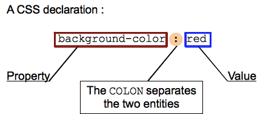

## Objectives and Overview

This lesson provides an overview of some terminology and provides a basic foundation of CSS. This lesson, as well as the remaining lessons in this module, intend to scratch the surface and be an introduction to CSS.

### Lesson Objectives

- Be able to explain what CSS is and the role it plays in web development.
- Recognize, understand, and explain explain common CSS terminology such as selectors, rules, declarations, properties, and values.
- Create a CSS stylesheet and link to it from an HTML document.

---

## CSS Overview

**CSS** stands for Cascading Style Sheets and is used to style web content. CSS is a presentation language that affects the appearance of content. If you think of HTML as the body, then CSS can be viewed as the clothes. Fonts, colors, page layout, and certain animations can all be done with CSS as well as much more.

Occasionally you’ll see code where the CSS is mixed in with the HTML. This has its uses, but for this course you’ll be keeping your HTML and CSS in separate files.

For this course, you’ll be writing your CSS in an external style sheet. This means that you’ll be writing all of your CSS in a file such as style.css and then linking to that file in your HTML.

The focus of this course isn’t on making you a CSS guru. Rather you should aim to become knowledgeable and familiar enough with CSS use to be able to understand how to set and alter the style of your page. There are a wealth of resources available if you’re interested in leveling up your CSS skills.

## CSS Terms

Just like HTML, JavaScript, and any other language, CSS has its own terminology. It’s good to review and use this terminology as much as possible so that you’re able to correctly recognize and understand resources that you discover.

The most important terms that you’ll encounter are: selectors, rules, declarations, properties, and values. Let's look at each of these terms.

### Selectors

Selectors are what you use to select which HTML elements you want to style. You can use combinations of several qualifiers to target unique HTML elements, depending on how specific you want/need to be. For example, you may be content to style all paragraphs on the page the same way, or you may need to be more specific and style only the first paragraph.

This selects all paragraph `<p>` elements on the page:

```css
p {
  ...;
}
```

In this example, the _p_ is the selector. Note that when you're referencing HTML elements in CSS you omit the brackets. For example, you use _p_ instead of `<p>`.

### Properties

Once an element or elements is selected, the styles that are applied are set as **properties**.

There are a large number of CSS properties that you can use, but here are some of the most common: `background`, `color`, `font-size`, `display`, `height`, and `width`.

The following example sets the `color` and `font-size` properties to be applied to all paragraph `<p>` elements:

```css
p {
  color: palevioletred;
  font-size: 12px;
}
```

Notice that the property names are contained within brackets { } after a selector, and are separated from their _values_ by a colon.

### Values

**Values** are what dictate the behavior of the property. In the previous example, both "palevioletred" and “12px” are values. Values are the text between the : after the property and before the ; at the end of the line.

### Declarations

A **declaration** is the pair of a property and value/values. Using the previous example, `color` and `font-size` are the properties, and `palevioletred` and `12px` are the values. Each of these is a **declaration**.

Both `color: palevioletred` and `font-size: 12px` are declarations.

Here is a helpful infographic from MDN:



### Rules

**Rules**, or **rulesets**, are the combination of the selector and the declarations. Building on the previous example, the ruleset for _p_ is the entire CSS block:

```css
p {
  color: palevioletred;
  font-size: 12px;
}
```

## Element and Type Selectors

The previous example used an element selector. This is used to target a specific element, such as paragraphs `<p>`. When working with CSS, you remove the `< >` signs from the element:

`<h1>` element would just be `h1` when selecting it in CSS.
`<li>` element would be `li`, and so on.

## Class and Id Selectors

Another, and much more targeted method for selecting HTML elements, is to use class and id selectors. This only works if the HTML elements have class and id properties.

Once you get in the practice of assigning ids and classes to your HTML elements, using id and class selectors in your CSS will become second nature. The structure is basically the same, as it still requires a selector, property, and value. The only difference is the syntax for selection.

### Class Selector Example

For this example, let’s say that you have a `<p>` with the class "main-content." The HTML would look like this: `<p class=”main-content”>`

To select this paragraph element when working with CSS, you use a period and then the classname:

```css
.main-content {
  color: #2a2a2a;
  font-size: 12px;
  font-family: Arial;
}
```

Remember, when working with classes you can have multiple elements sharing a classname. You could have multiple `<p>` elements with the "main-content" class. All of the elements with that class would then use the styles you set.

### Id Selector Example

To work with an HTML element that contains a unique id, you use the # and the id name as a selector. For this example, let's say you have an `<h2>` with the unique id “special-heading." The HTML would look like this: `<h2 id=”special-heading”>`

The style would only impact the `<h2>` with that particular id. Remember that ids are unique per page, so this is a great way to very specifically target a certain element.

### Note on using Id Selectors

While using id selectors is a useful thing to have in your toolbox, it's considered best practice to avoid using them for CSS purposes. The reasoning for this is rather complex and not necessary to understand right now, but the common _best practice_ for CSS is that you should only use classes.

You may now be wondering when you'd use id selectors. The short answer is that these are often reserved for use with JavaScript interaction with webpages.

The next question you may have is what you'd do if you need to select a _specific element_ with classes. There are many schools of thought on this, but one way is that you can use specific class names that only target a single element and don't repeat. For now, don't worry too much about this process and just focus on practicing CSS.

## Activity: Create and Link a CSS Stylesheet

While your individual style rules may be different than those of your peers, the process for linking an external stylesheet is the same for everyone.

### Steps:

Before starting, make sure that your stylesheet is in the same folder as your HTML files. These steps assume your stylesheet is in the same folder. It’s much easier (and common) to place the stylesheet in the same folder.

1. Open one of your project folders in VS Code
2. Make sure that you're in the same folder, and then create a new file
3. Name this file something like `style.css` and save it
   - When linking, make sure that you use the actual name of your stylesheet!
   - This example uses _style.css_ for the name.
4. At the bottom of the `<head>` section before the `</head>` tag, add the following:
   - `<link rel=”stylesheet” href=”style.css”>`
5. Save your HTML file!
6. Repeat this process for each HTML file you want to style.

**Note**: You’ll need to complete this process for every page that you want to use the style rules. For example if you have an _index.html_, _about.html_, and a _contact.html_ and intend to use your stylesheet for all of the pages, you’ll need to link to the stylesheet in every HTML file.

### Why in the Head?

Notice that the stylesheet link is a similar structure to the anchor (`<a>`) links you’ve used. This is a similar link structure for when you’ve linked to other pages, except this time you’re linking to a stylesheet instead of another .html file. The `rel` and `type` properties are included to clarify that you’re linking to a stylesheet, and then the href is the file name.

The stylesheet is placed in the _head_ (not header!) because you want all of your styles to load before the body. The body contains the content that you’re styling, so you want your style rules to load before the content. If you were to link to the stylesheet after the body, the style rules won’t apply.
