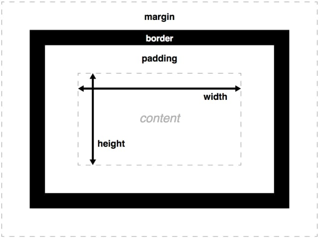

## Objectives and Overview

This lesson provides an introduction to some fundamental concepts related to CSS displays and layouts. This is a massive topic, and this lesson aims to scratch the surface with core topics. Developing a solid understanding of these basics will establish a foundation for learning CSS layout topics in your future exploration.

### Lesson Objectives

- Identify and explain the difference between _block-level elements_ and _inline-level elements_.
- Understand the CSS box model and the role it plays in display and layouts.
- Explain how the default page flow is calculated, and how you can change this behavior.

---

## Page Layout with CSS

Now that you’re familiar with creating a basic HTML page structure and comfortable using CSS selectors, it’s time to understand how elements are displayed on a page. You may have noticed that webpage layout is often structured as boxes. This is a carryover from the way that printing presses were used in page layout. Presenting information in groups of boxes is often a clear way to communicate with an audience.

## How Elements Display

Before jumping into the box model, it helps to understand how elements are displayed. There are two different types of elements: _block-level elements_ and _inline-level elements_.

Block-level elements always begin on a new line and occupy any available page width, regardless of their content. Block-level elements are generally used for larger pieces of content, such as headings, paragraphs, and structural elements.

Inline-level elements don’t begin on a new line. Instead they’re contained in the normal flow of the content. Inline-level elements occupy only the width their content requires. Inline-level elements are generally used for smaller pieces of content, such as a few words selected to be bold or italicized.

## Sizing and the CSS Box Model

One of the most important CSS layout skills to understand is the box model. While this has more to do with sizing than actual page layout, it's crucial to understand how CSS processes space before diving into other layout topics.

The box model can be frustrating if the time isn't taken to understand how CSS processes sizing. All HTML elements are represented as rectangular boxes. This may be confusing at first, but just imagine that every single element on your page has an invisible box drawn around it. The _appearance_ of these boxes, such as color, borders and size are determined by CSS properties.

The total size of each HTML element box is determined by the following properties:

Margin, border, padding, and content. The sizes of each of these properties determine the _total size_ of the element.

Take a look at this image from the [MDN Web Docs](https://developer.mozilla.org/):



Let's take a look from the inside out, since you'll almost always begin with the content.

**Content**: The size of your actual content, whether it's an image, heading, or paragraph. Let's say that you create a paragraph that is 20px tall and 20px wide. These values are the content height and width.

**Padding**: Padding is a layer that surrounds your content on the top, left, bottom, and right. Think of padding as packing material in a mail package. You can set each padding property separately. For example, you may want the top padding to be 20px and the right padding to be 40px.

**Border**: Borders aren’t going to be visible unless you specifically set their properties, but they’re the next layer in the box model. If you have 5px of padding surrounding your content, the border would appear 5px away from the actual content.

**Margin**: Margin is the outermost layer of the box. The margin property determines how much space surrounds the element.

For additional reading about the Box Model, check out this Mozilla Developer Network link: [MDN: Introduction to the CSS Box Model](https://developer.mozilla.org/en-US/docs/Web/CSS/CSS_Box_Model/Introduction_to_the_CSS_box_model).
This section refers to much of the content presented on the linked MDN resource page. If you’d like more detail about any of these points, you should head to that link.

### Tip: CSS Box Sizing Property

There is a CSS property that relates directly to the box model: `box-sizing`. This property sets how the calculation for _total width and height_ of an element is done.

The default setting for this is `box-sizing: content-box` which means that the total size is determined by the content's width and height with the border, padding, and margin added _after_. This default behavior can be confusing when creating layouts.

Another setting is `box-sizing: border-box` which means that the total size is _adjusted_ to include the border, padding, and margin.

<!-- TODO:
INCLUDE EXAMPLE
 -->

## Document Flow: Default Layouts

Before diving into any methods for customizing and styling page layout, it's worth understanding the default page flow. A basic understanding of the box model is important for this, so make sure you have a grasp on that before reading further.

Much of this section references this resource: [MDN: Normal Flow](https://developer.mozilla.org/en-US/docs/Learn/CSS/CSS_layout/Normal_Flow). Check it out for a deeper dive into this topic!

### Block Elements

The default display for any block element is 100% width of the parent element and a height that's 100% of the content height. Remember, the content height contributes to the box model. When considering the height of block elements, the content height is the amount of space taken up by the actual content. This may sound obvious, but let's make sure it's clear. If you have a paragraph that contains text, and that text takes up 50px, the content height is 50px. This is what's used to calculate the height for block elements.

There are lots of block elements, but here are some that you've encountered in this course:

- Articles: `<article>`
- Asides: `<aside>`
- Divs: `div`
- Headers and Footers `<header><footer>`
- Headings: `<h1><h2><h3><h4><h5><h6>`
- Lists: `<ol><ul><li>`
- Mains: `<main>`
- Navs: `<nav>`
- Sections: `<section>`
- Paragraphs: `<p>`

By default, these elements will behave as block-level elements unless you specifically change the `display` property. You can experiment with this by using these elements in an HTML document and then previewing it. The width of each element will span the entire _body_ of the page, with the height as tall as the content height of each element.

For a full list of block elements, check out this resource: [MDN: Block-level elements](https://developer.mozilla.org/en-US/docs/Web/HTML/Block-level_elements).

### Inline Elements

Inline elements are both as tall AND as wide as the content. This means that both the content width and height are used when calculating the display size. This can sometimes behave unexpectedly and is often a source of confusion when learning CSS.

One important note about inline elements is that you _can't set the width or height!_ This is one of the most common use-cases for changing the display property of these elements. For example, if you want to adjust the width and height of an image, you'd need to set `display: block` first, and then set the `width` and `height` properties.

There are lots of inline elements, but here are some that you've encountered in this course:

- Anchors (links): `<a>`
- Text decoration:
  - Strong: `<strong>`
  - Emphasis: `<em>`
- Images: ``
- Spans: `<span>`

For a full list of block elements, check out this resource: [MDN: Inline-level elements](https://developer.mozilla.org/en-US/docs/Web/HTML/Inline_elements).

## The Display Property

CSS has the `display` property for working with layout. There are many different layout properties, but for now, focus on using _inline_, and _block_. As your CSS skills develop and you seek out new skills, you'll encounter `display: inline-block`, `display: flex` and `display: grid`. Inline-block is a combination of inline and block, but the usage is outside of the scope of this course. For now, focus on practicing with inline and block.

The other two properties, `display: flex` and `display: grid` are for the powerful (and relatively new) CSS tools Flexbox and Grid. These are both out of the scope of this course, but are absolutely worth learning if you're interesting in web development.

With that said, let's take a look at the inline, block, and inline-block properties.

## Adjusting Margin and Padding

Two of the most impactful methods for adjusting layout are to change the *padding* and *margin* values for your HTML elements.

Remember, you can set the padding and margin for each side of an element independently. For example:

```css
.my-element {
  padding-top: 8px;
  padding-bottom: 16px;
  padding-left: 16px;
  padding-right: 16px;

  margin: 16px;
}
```

The above example would set the padding of the top, bottom, left, and right sides independently and then set *all* of the margins to 16px.

There are two shorthands you can use for padding and margin. Using `padding: 16px` or `margin: 16px` sets all of the sides to the same value.

If you use `padding: 0 16px` or `margin: 0 auto`, the first number is the top and bottom, and the second is the left and right. You'll often see `margin: 0 auto` used to provide automatic centering on certain elements.

## Activity: Adjusting the Layout


## Going Further Resources

The intent of this lesson is to provide an introduction to key display and layout topics. 

If you're interested in a clear tutorial that covers how to center different types of elements with CSS, check out this article by Flavio Copes: [Flavio Copes: How to center an element with CSS](https://flaviocopes.com/css-centering/)

Flavio's article shows examples with both CSS Grid and Flexbox. Go ahead and experiment if you're interested!