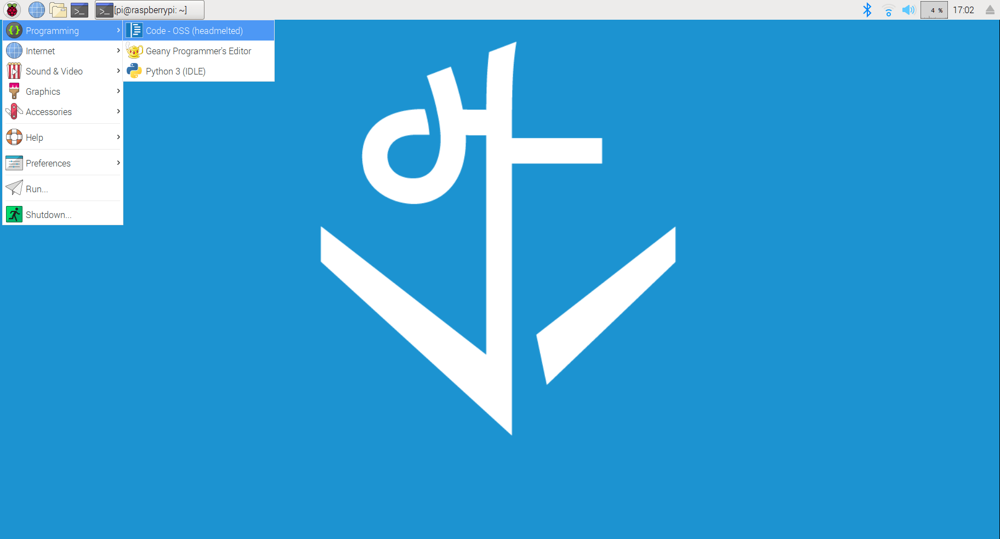
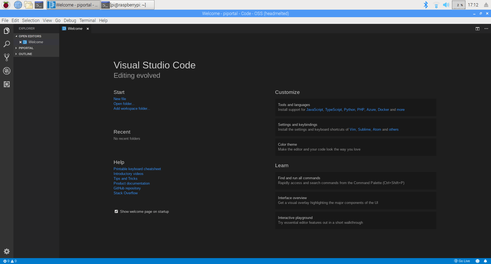
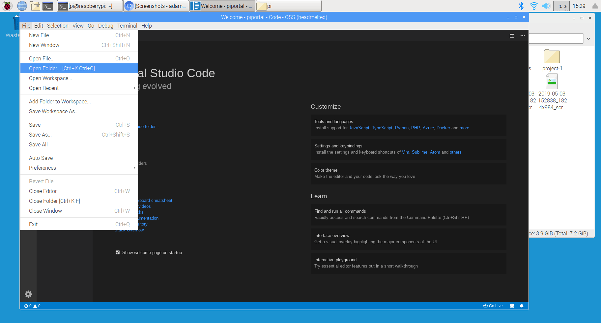
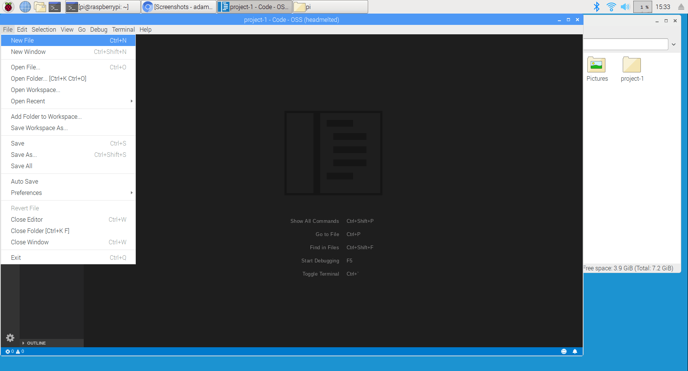
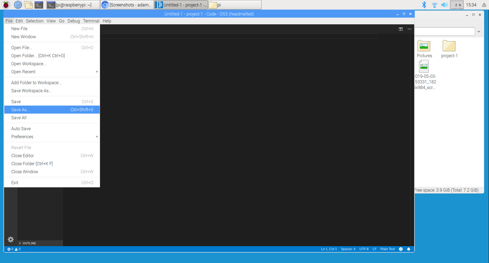

## Objectives and Overview

This lesson introduces VS Code, the text editor that you'll be using throughout this course. As you work through the course you'll become more familiar with VS Code, but this lesson gets you started and provides an overview of many core features.

**Note:** You're using a special version of VS Code made to work on the Raspberry Pi. The file itself is called _headmelted_. Even though the name differs, the program itself is VS Code. The VS Code skills and practice that you learn in this course will be applicable if you use VS Code for macOS, Linux, or Windows.

### Lesson Objectives

- Recognize the purpose of a text editor in web development.
- Become familiar with the VS Code interface and shortcuts.
- Demonstrate the ability to create and edit new files in VS Code.

---

## What is VS Code?

During this course you’re going to be using VS Code (Visual Studio Code), a free and powerful editor developed and maintained by Microsoft's open source team. Even though its a Microsoft product, VS Code works on Windows, Mac, and Linux. VS Code has quickly become the most recommended and used text editor, especially for web development.

## File Management and Text Editors

Knowing how to work with a text editor and manage files is an important piece of web development. Many e-learning platforms that teach web development often don’t integrate this piece, and this creates some difficulty when transitioning into practical development. In this course, you’ll be practicing these concepts from the beginning.

## Using a Text Editor

HTML, CSS, and JavaScript files are plain text files that have specific file extensions: .html, .css, and .js. There are several text editors out there, and you’ll want to use one that you’re most comfortable with. One key thing to consider is a syntax highlighting feature. All professional level text editors will have syntax highlighting.

One of the best features of VS Code is that it is highly customizable and highly responsive. Over the past two years there has been a widespread adoption of VS Code in the developer community. This means that there is a wealth of extensions for VS Code, so you’re likely to be able to find any additional features that you need.

## Opening VS Code on the Raspberry Pi

To open VS Code, click on the Raspberry Pi icon from the desktop and then click on the _Programming_ menu. From here, click on the first option: _Code - OSS (headmelted)_:

Once you click this, VS Code will launch. Remember, even though this is named _headmelted_, it's actually VS Code -- the name is different since it's a special "port" of VS Code that works on the Raspberry Pi. Just keep this in mind as you're starting off with VS Code.

## VS Code Interface Tour

VS Code's interface can be overwhelming at first, but it'll become intuitive as you explore and use the features.

Let's take a quick look at the basic interface:

The sidebar is the file explorer. Your project files will show up here as you add them to the project folder. You can switch active files by clicking on a file.

This sidebar can also be hidden by clicking on the file navigation icon -- this is the top icon on the sidebar that looks like a stack of papers. Clicking it again will bring the file navigation sidebar back.

In the previous screenshot, the main interface shows the welcome screen. However, once you start working on a file this is where you'll write your code.

All of the windows can be adjusted by clicking and dragging. Go ahead and try!

## File Management

You’re going to want to develop a consistent system for managing the folders and files for each new project. You'll want to create a folder for each project.

Go ahead and create a project folder. Look back to the _Raspberry Pi: GUI Overview_ lesson if you're unsure how to create a folder.

Once you've created a folder, you can open it in VS Code by clicking **File->Open Folder** and then selecting the folder from the file explorer that opens.

Here's a screenshot showing the menu:

Once you've loaded a folder, let's create a new file.

## Creating a New File

Open VS Code and go to **File->New File**.

Here's a screenshot showing the menu:

Once you click this, a new untitled file is created. Select **File->Save As** from the menu to rename the file. Name it _index.html_ to prepare for the next lesson:

You now should have a new file named _index.html_! If not, make sure to create this before moving on.

## Going Further

One of VS Code's strengths is its flexibility and extensibility. There are many plugins and extensions that increase the power. After this course you'll have a solid foundation in VS Code, but if you're looking to build your knowledge, here are some resources:

- [Microsoft: Getting Started With Visual Studio Code](https://code.visualstudio.com/docs/introvideos/basics)
