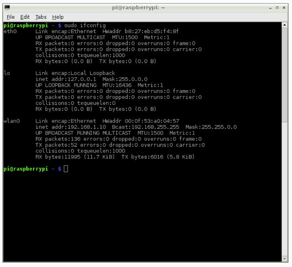

## Objectives and Overview
...

### Lesson Objectives

- Explain the difference between internal and external IP addresses.
- Discover the role that DNS plays in connecting domain names and server IP addresses. 
- Identify your Raspberry Pi’s IP address.
 

### CSTA Standards

- **2-NI-04** - Model the role of protocols in transmitting data across networks and the Internet.
- 
---

## IP Addresses

You've probably heard the term **IP address** somewhere in your internet exploration, but let's take a deeper look at what an IP address actually is. IP addresses are the core of the internet. Every website on the internet has a server with an IP address that serves the content. While you see and remember the addresses of these sites by the human-readable domain names, computers only use IP addresses. It's important to understand the basics of IP addresses since this is a crucial web concept. Let's dive in!

### Raspberry Pi's IP Address

As soon as your Pi connects to the internet on the local network, it has an IP address. This is true for any device that connects to a Local Area Network. It's important to know how to find your Pi's IP address, especially in the context of this course. You'll need to know the IP address to connect via ssh, which is something that is covered in a later lesson. For now, let's look at how to find your Pi's IP address.

There are two main ways to find your IP address. The first requires a display, whereas the second can be done strictly through the command line. You won't always have access to a display, especially if you're working on the Pi in a web project. Since this course focuses on using the Pi in a web setting, you're going to find your IP address via the command line in Terminal.

### Finding Your IP Address

There is a command line command that finds your Pi's IP address. Open up the Terminal application in your Pi. Next, type the following command: ```sudo ifconfig```. 

This will return your Pi's IP address. Check out this screenshot taken from Adafruit's blog:



This command returns lots of information. Your IP address is found in the ```wlan0``` section next to the ```inet addr```. In the above example, the Pi's IP address is ```192.168.1.10```.

## DNS

**DNS** stands for **Domain Name Server**. Essentially, this is what transfers the text of a **domain name** into an IP address. While the domain name text is easy for humans to write and remember, computers need to translate these into the IP addresses. Computers access websites via IP addresses. Each server that serves web content has an IP address that is accessed by other computers, such as your web browser.

Imagine how difficult it would be to remember *every website* as a series of numbers instead of domain names. It's much easier for us to remember websites as readable words instead of numbers, but computers need to be able to translate these words into numbers. The computer needs the actual IP addresses but it would be nearly impossible to remember all of the IP address combinations for the number of websites on the internet.

The DNS is what glues this together. When you register for a new domain name for a website, part of the process is connecting your domain name to the IP address of the server.

Here is some additional reading on the history of DNS: [Link to the article 'What is DNS?'](https://dnsmadeeasy.com/support/what-is-dns/)

## Activity: Finding Your IP

The objective of this quick activity is to determine your Pi's IP address. This process is fairly quick and can be done by following the steps (or video) outlined in this lesson.

- Open a command line prompt
- Use the ```sudo ifconfig``` command to find your IP address
- Write down (or memorize) your IP address