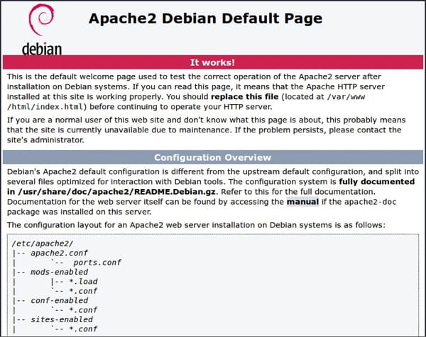

## Objectives and Overview

This lesson provides a basic overview of the process of serving content from your Pi using Apache Web Server.

### Lesson Objectives

- Explain where the default Apache web page comes from.
- Identify and explain how the Apache directory relates to the content users see when they navigate to your Pi's IP address.

---

## Setting Up the Server

Your web content needs to be in a specific location in order for the server to know what content to respond with. If your content isn’t in the correct location the server won’t send the content in the response. Additionally, you need to make sure that your server configuration is correct and matches the content location. Much of the troubleshooting that you may need to do stems from these areas. Often a file isn’t placed in the correct location, or the configuration doesn’t match with the file locations. Sometimes, even a small typo can cause your server to have errors!

## Default Web Page

Apache has a default web page that is served once you set up the server software. Seeing this initial web page often provides great relief after you’ve been working to install and configure a server. Here’s an image of the Apache default web page:

If you open up _http://localhost/_ on your Pi, or have someone navigate to your Pi’s IP address, they’ll see the Apache default page. If they don’t, then you know that you may need to do some additional troubleshooting. The default page is a good visual checkpoint to make sure that your server is correctly serving content.

## Default Web Page Location

You may now be wondering where these default pages come from. They are html (or sometimes php) files stored in a specific location that the web server is configured to point to. The specific default page is an _index.html_ file located in the directory. Apache serves the default web page from the _/var/www/html/_ directory. Let’s navigate to that directory:

Open a terminal and use cd to change directory to the proper location — ask for help if you forget how to do this!
Once in the _/var/www/html/_ folder, list out the files with `ls`.

You should see an _index.html_ file! This is the default web page.
