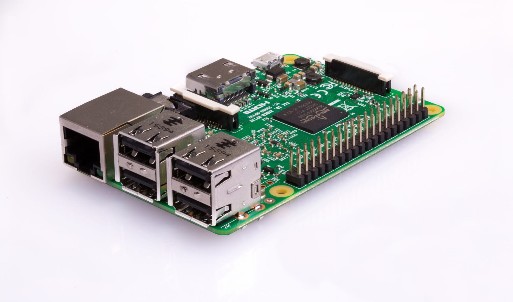
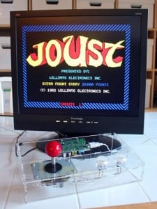
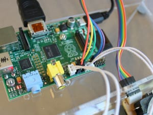
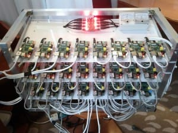
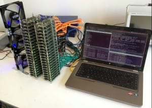

## Objectives and Overview

This lesson introduces the Raspberry Pi and provides an overview of some of the strengths of the tool. Part of understanding the particular strengths is to understand when not to use it, so the lesson includes a comparison of a Raspberry Pi and an Arduino. Since the Pi is such a flexible tool, the lesson concludes with some example projects using a Raspberry Pi.

This lesson introduces the Raspberry Pi and provides an overview of some of the strengths of the tool. Part of understanding the particular strengths is to understand when not to use it, so the lesson includes a comparison of a Raspberry Pi and an Arduino. Since the Pi is such a flexible tool, the lesson concludes with some example projects using a Raspberry Pi.

### Lesson Objectives

- Become familiar with the Raspberry Pi and identify the strengths of the tool.
- Understand and explain the differences between a Raspberry Pi and an Arduino (and other microcontrollers).
- Recognize example projects that use a Raspberry Pi.

### CSTA Standards

- **2-IC-20** - Compare tradeoffs associated with computing technologies that affect people's everyday activities and career options.

---

### What is a Raspberry Pi?

A Raspberry Pi is a small, \$35 credit card sized computer that runs the Linux operating system. These powerful computers are flexible enough to be the backbone of a variety of projects ranging from webservers to vintage arcade systems.

Raspberry Pi can interact with the physical world through the **GPIO pins**. GPIO stands for general purpose inputs and outputs, and this is where you can attach external devices such as motors, LEDS, and other sensors. This is outside the scope of this course, but this *physical computing* is one of the core strengths and appeals of the Pi.

The [Raspberry Pi Foundation](https://www.raspberrypi.org) do lots of great work to support education and the community of educators, learners, tinkerers, and technologists using Raspberry Pi. They've created a great introductory video the provides a quick overview of the Pi.

Check out the introduction video from the Raspberry Pi Foundation:

<iframe src="https://www.youtube.com/embed/uXUjwk2-qx4" width="600" height="400" allow="accelerometer; encrypted-media; gyroscope; picture-in-picture"></iframe> 
 
## Raspberry Pi Comparisons: Arduino

If you’ve seen or used an Arduino, you may be wondering the core differences between a Raspberry Pi and an Arduino. On the surface it may seem as if they’re the same thing, especially considering the variety of projects that both can power.

The core difference is that the Arduino is a microcontroller and the Raspberry Pi is more like a computer. An Arduino can be programmed to run a single program repeatedly, while a Raspberry Pi can run multiple programs even at the same time.

Let’s look at some use cases when you’d want to use a Raspberry Pi instead of an Arduino.

### When to Use a Raspberry Pi?

You may be thinking that the Raspberry Pi is more powerful than an Arduino since it can run more programs and act more like a computer. This isn’t necessarily the case -- as with any other tool, it’s all about knowing when and how to use each it!

Arduinos are highly effective for repetitive tasks such as powering a motor, reading temperature settings, or controlling a sequence of LEDs. Arduinos are often used as the control board for 3D printers since the printers run a specific program over and over.

Raspberry Pi is effective when you need a smaller version of a computer. For example, you could use a Pi to power a webserver, power a vintage arcade system, or when you need to run a variety of programs at once.

This [Make Magazine article](https://makezine.com/2015/12/04/admittedly-simplistic-guide-raspberry-pi-vs-arduino/) has a great summary of the decision process. Basically, think about the functionality of your project, and then if you can describe the functionality with “less than two ‘and’s” you should use an Arduino. Even though the article is a few years old, check it out for more information and examples.

## Raspberry Pi Project Examples

This section contains projects that are powered by a Raspberry Pi. These are all quite different -- this demonstrates the flexibility and power of the Raspberry Pi. Let’s take a look a deeper look!

### Pocket PiGRRL - Raspberry Pi 'Gameboy'

The Pocket PiGRRL is a DIY gaming device that looks like an old Nintendo Gameboy. This is available as a kit. Check out the kit and lesson from Adafruit by clicking on this link: [Adafruit Pocket PiGRRRl Lesson and Kit](https://learn.adafruit.com/pocket-pigrrl/overview).

This video provides an overview of the project:

<iframe src="https://www.youtube.com/embed/dEdVEQqoIJQ" width="600" height="400" allow="accelerometer; encrypted-media; gyroscope; picture-in-picture"></iframe>

### Retro Gaming Console

This project uses a Raspberry Pi to power a vintage gaming console modeled after arcade cabinet games. This particular one includes an acrylic case and a joystick.

Here is a closeup of the Raspberry Pi within the enclosure:

### Raspberry Pi Super Computer

This example is of a Raspberry Pi 'super computer.' This project is actually several Raspberry Pi used together to pool processing power.

Here is another example of several stacked Raspberry Pi sitting next to a laptop:

If you're interested in learning more, check out this video about Raspberry Pi super computers:

<iframe src="https://www.youtube.com/embed/ubUTTrbEckM" width="600" height="400" allow="accelerometer; encrypted-media; gyroscope; picture-in-picture"></iframe>

### Raspberry Pi Tablet

Another example project is a Raspberry Pi Tablet. There are several different examples of this project, but one of the more well-known is the _pi-top_. The pi-top is a modular laptop powered by a Raspberry Pi. Here is their website if you're interested in check out their products: [pi-top Website](https://www.pi-top.com/).
