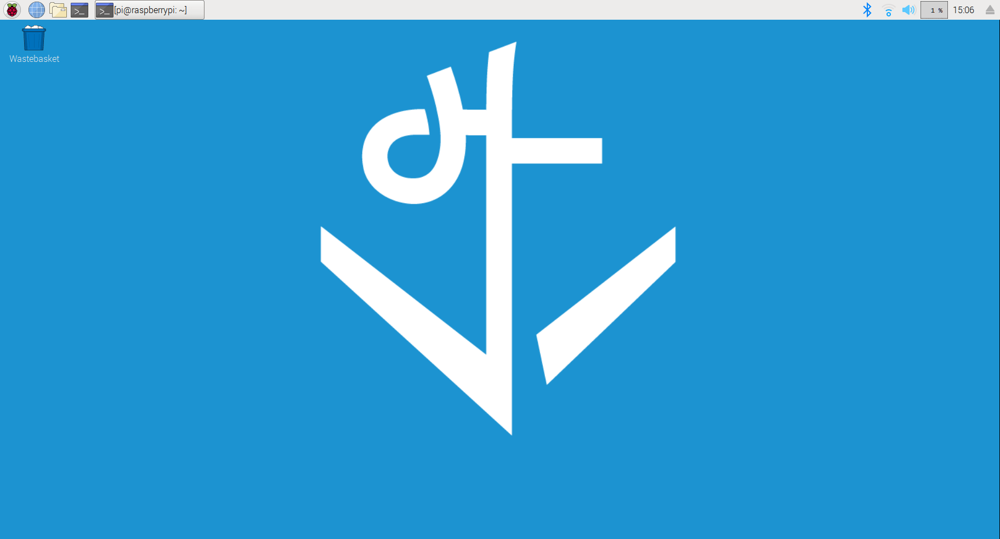
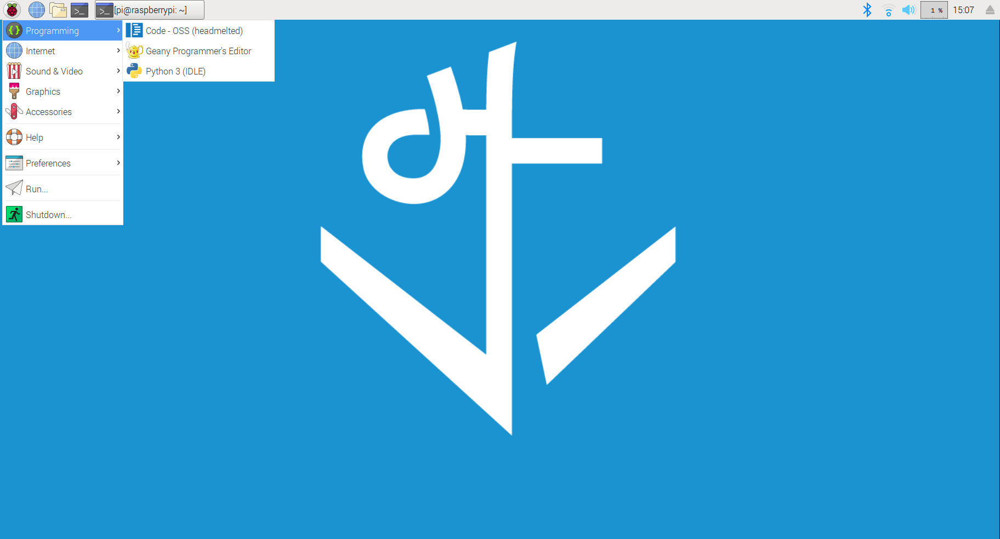
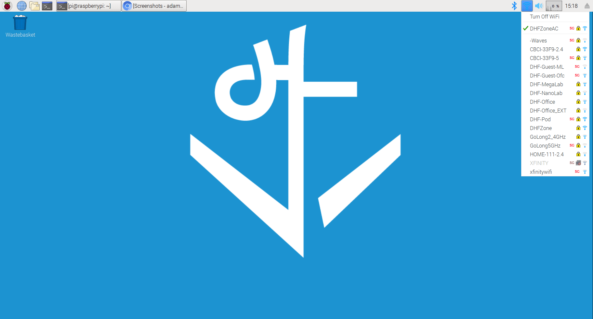
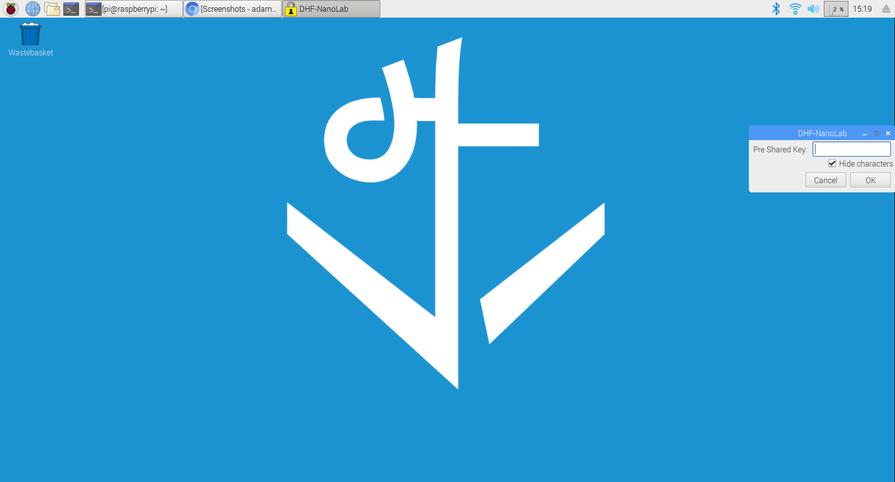
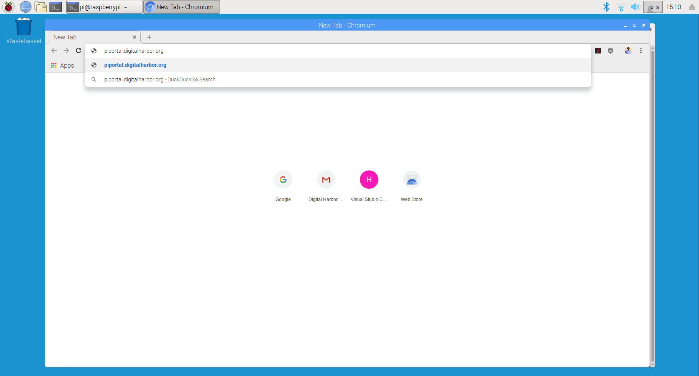
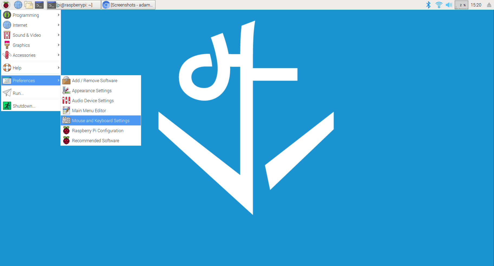

## Objectives and Overview

This lesson provides a virtual "tour" of the Raspberry Pi GUI (Graphical User Interface). Included is an overview of the desktop, basic file navigation, launching applications, and other common tasks.

### Lesson Objectives

- Build familiarity with the Raspberry PI GUI.
- Understand how to navigate the filesystem, launch applications, and power down the Raspberry Pi via the GUI.

---

## Overview of the Desktop

## Basic File Navigation

## Launching Applications

## Powering Down the Raspberry Pi

## Configuring WiFi Network

## Opening Chromium

## Configuring Mouse and Keyboard Preferences

