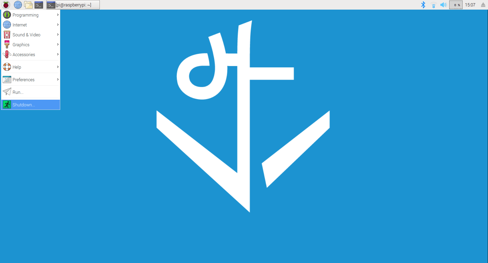

## Objectives and Overview

This lesson provides a virtual "tour" of the Raspberry Pi GUI (Graphical User Interface). Included is an overview of the desktop, basic file navigation, launching applications, and other common tasks.

### Lesson Objectives

- Build familiarity with the Raspberry PI GUI.
- Understand how to navigate the filesystem, launch applications, and power down the Raspberry Pi via the GUI.

---

## Overview of the Desktop

Once you get used to some slight differences, the Raspberry Pi GUI feels very similar to the Windows and macOS desktops that you've used before. One of the most powerful aspects of the Raspberry Pi is that it can function very similarly to a desktop computer. When you start navigating the GUI, you really see how the Raspberry Pi is like a "credit card sized computer."

Here's a screenshot of the desktop:

There are many features that should be familiar. The _Raspberry Pi icon_ acts as the "start" menu where you can launch applications, browse the file system, set preferences, and many other things. Think of this as your launchpad.

To the right of the Raspberry Pi are a series of useful shortcuts. The first shortcut looks like a globe. This is the web browser. The next one, the folder, is the file system shortcut. The last one is the terminal. You'll use all three of these shortcuts throughout the course.

Next to the shortcuts are where your minimized tabs show up. In the screenshot above there is a tab open for the terminal session. Clicking on these brings the tab into full view.

To the far right are the other system controls such as Bluetooth connection, WiFi, volume, CPU load, and current time. As you navigate the desktop many of these shortcuts will become intuitive!

The next several sections of this lesson provide more detail about each of these areas.

## Basic File Navigation

Let's dive into some basic file navigation on the GUI. You'll likely find that using the filesystem is very familiar.

To start, click the folder icon:

This opens up the file explorer. Check out this screenshot:

The left sidebar is the file explorer. The _pi_ folder is your home directory. Clicking on the folders will open them up for further exploration.

## Creating Folders

Now let's look at how to create new folders. You're going to do this from within the file explorer. If you closed out the file explorer, go ahead and follow the steps in the previous section to open it back up.

To create a new folder, right click in the explorer and select _Create Type_ and then choose _Folder_:

Once prompted, type in a name for the folder and hit enter to save it:

If you're following along now, go ahead and create a new folder and name it something like _project-1_.

## Launching Applications

You're also able to launch applications from the GUI. The quickest way to do this is to click on the _Raspberry Pi Icon_, which brings up a menu:

From here you can click on the applications that you want to launch. Note that if you're launching an application that isn't listed, you can always navigate to it in the file explorer and double click it.

## Configuring WiFi Network

The Raspberry Pi 3 has built-in WiFi, so the process of finding and configuring the WiFi networks will be similar to other computing interactions. However, you'll often find that you need to switch networks or add a new one. Let's go over this process.

If you're connected to a network, the WiFi icon in the top right of the desktop will be blue. Clicking on this icon brings up a list of networks, with a checkmark next to the one you're currently connected to:

Clicking on another network in the list switches your connection. If the network is password protected, you'll be prompted to enter the password:

Once you enter the password click the _Ok_ button. If the credentials are correct you'll connect to the network. Note that you can uncheck the "Hide characters" option if you want to see the password as you type it.

## Configuring Mouse and Keyboard Preferences

You may want to configure the sensitivity of your mouse and keyboard. These settings can be found in the main start menu accessed by clicking on the Raspberry Pi icon. From there, click on the _Preferences_ tab, and then the _Mouse and Keyboard Settings_ entry.

This pulls up the settings for both the mouse and keyboard:

Go ahead and explore these options!

## Powering Down the Raspberry Pi

The last GUI task covered in this lesson is the power options for the Raspberry Pi. From here, you can shutdown or restart the Pi.

To access this, click the Raspberry Pi icon and select _Shutdown_:

This brings up another set of options where you can choose to either shutdown or restart the Pi.
