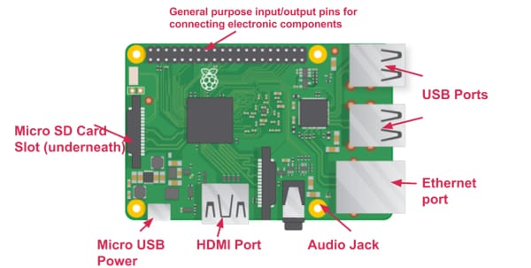
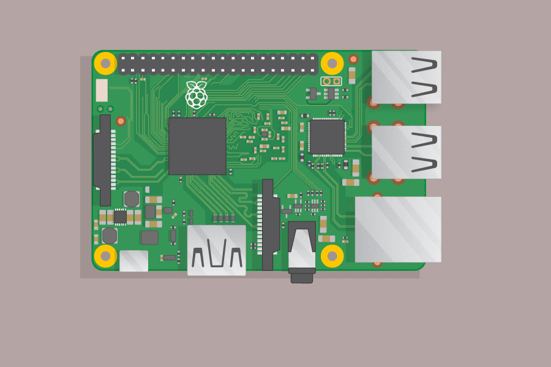

## Objectives and Overview

This lesson provides a virtual "tour" of the physical layout of a Raspberry Pi. Additionally, the lesson includes discussion about hardware *peripherals* that can be attached to a Pi, and includes instruction and troubleshooting for attaching common peripherals such as keyboards, mice, and monitors.

### Lesson Objectives

- Identify the hardware components on a Raspberry Pi and explain their role.
- Identify how to attach peripherals to a Raspberry Pi and demonstrate this by setting up your Raspberry Pi.

### CSTA Standards

- **2-IC-20** - Compare tradeoffs associated with computing technologies that affect people's everyday activities and career options.

---

### Raspberry Pi Layout

Even though the Raspberry Pi is roughly the size of a credit card, there's quite a lot of power packed into it! 

Here's an image of a Raspberry Pi with several of the components marked:

*Image Credit: The Raspberry Pi Foundation*

Let's take a look at each of these core components.

### GPIO Pins

The GPIO pins are one of the most commonly utilized features of the Raspberry Pi. GPIO is **General Purpose Input/Output** and act as the *bridge* between the Raspberry Pi and the world. These can be used as **inputs** to receive data from the world through devices such as temperature and light sensors. The pins can also be used as **outputs** where signals are sent *from* the Raspberry Pi to external items such as LEDs and motors.

There are 40 total GPIO pins on the Raspberry Pi, and certain pins have specific functionality. 

Physical computing with the Raspberry Pi is outside of the scope of this course, but there are plenty of resources on the topic if you're interested. Here's a link on the Raspberry Pi Foundation site if you're interested in learning more: [Raspberry Pi Foundation resource on Physical Computing](https://projects.raspberrypi.org/en/projects/physical-computing).

### Micro SD Card Slot

This is the slot where the SD card is inserted into the Pi. The SD card contains the actual operating system of the Pi, as well as files and other crucial pieces. The Raspberry Pi needs the SD card to even boot. If your Pi is missing the SD card, it won't be able to boot into the OS. 

Make sure to keep your SD card safe! You can safely leave it inserted in this slot. If you're experiencing issues with the Pi booting, make sure to check that you have an SD card inserted and that it's *firmly* connected. When inserting the SD card you'll feel a bit of a 'click' once it is fully connected.

### Micro USB Power

This is the port where the power source connects to the Pi. The Raspberry Pi powersupply connects via Micro USB. Make sure that you tightly connect the USB power source into the Pi. This is another connection to check if you're experiencing unusual before with your Pi, such as the power cutting out.

In our experience, this connection can be damaged when people carelessly plug/unplug their Pi. Additionally, if the connection is bumped or placed on its side the Micro USB connector can be damaged or broken. 

### HDMI Port

The HDMI port connects a monitor to the Pi. The current models use HDMI for the connections. If you're connecting non-HDMI monitors you'll need to use an HDMI to VGA converter. Even if you use one of these connectors, the actual port on the Pi is HDMI. 

This is another port that can be damaged if care isn't used when plugging and unplugging the connection. Once connected, try to make sure that the HDMI cable doesn't get bumped or knocked loose!

### Audio Jack

The audio jack is where headphones or speakers connect to the Pi. Standard headphones or desktop speakers fit into this port.  

### Ethernet Port

The ethernet port is where you'd connect an ethernet cable for wired network connection. This is commonly used when a Pi is in a more permanent location. The current Pi models have onboard WiFi support that is fairly straightforward to configure. The WiFi is used when the Pi's location isn't fixed or when an ethernet connection isn't available. It's important to know that your Pi has the ability to connect to the network via a wired connection.

### USB Ports

These are multi-purpose USB ports and are often used for connecting peripherals such as a USB mouse and keyboard. The Raspberry Pi 3 Model B+ that you're using for this program have 4 USB 2.0 ports. You can also connect flash drives and external hard drives. 

## Raspberry Pi Peripherals

Throughout this lesson you've encountered the term *peripherals*. This is the term for the external devices that connect to the Pi. Common peripherals are the monitor, keyboard, and mouse. The addition of these three peripherals allows you to utilize the Pi in a similar way that you'd use a desktop computer. 

The process for connecting peripherals to a Raspberry Pi is straightforward but there are a few *gotchas* to be aware of. The next section covers this process.

### Connecting Peripherals to a Raspberry Pi

If you have experience setting up a desktop computer, you've likely been through the process of connecting the monitor, keyboard, and mouse.

The biggest 'gotcha' for connecting peripherals is that the **order matters**! This is one of the most common problem areas for setting up the Pi, and is something to be aware of for troubleshooting purposes. Typically, any hardware peripheral that is connected to the Pi *after the Pi is booted* won't be detected and usable until after rebooting. 

For example, if you're using your Pi without a mouse and decide you to use one and connect it to the USB port, you won't be able to use the mouse until after rebooting. 

Generally, the order for attaching peripherals is this:
1. Unplug the Pi power supply
2. Connect **all** peripherals that you want to use (keyboard, mouse, monitor, etc.)
3. Plug in the Pi!

The Raspberry Pi Foundation has provided an animated GIF showing the order peripherals should be attached. Here is the animation of the peripheral setup process:

*Animation Credit: The Raspberry Pi Foundation*

As you're working through the course, you may want to periodically check back to this lesson as a refresher. Often many hardware issues result from issues described in this lesson. If you experience any of these common hardware issues, don't panic! Try to remember these steps and troubleshoot the issue yourself -- or at least try to identify the potential issue.